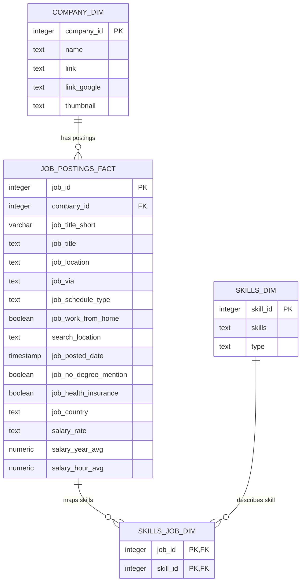

# Entity-Relationship Diagram

This diagram documents the supported physical PostgreSQL schema used by the project. The `analytics` schema contains views derived from these four source tables and is documented separately in the data dictionary.

## Grain and relationships

- `company_dim`: one row per company identifier.
- `job_postings_fact`: one row per job posting.
- `skills_dim`: one row per skill identifier.
- `skills_job_dim`: one row per unique `(job_id, skill_id)` relationship.
- `company_dim` to `job_postings_fact`: one company can be referenced by many postings; a posting can have a nullable company reference.
- `job_postings_fact` to `skills_job_dim`: one posting can have zero or many skill relationships.
- `skills_dim` to `skills_job_dim`: one skill can appear in zero or many postings.

## Analytical model

`analytics.data_analyst_postings` filters the fact table to Data Analyst postings and adds a normalized `work_mode` classification. `analytics.data_analyst_skills` expands that view to posting-skill grain by joining through `skills_job_dim` and `skills_dim`.

See [`DATA_DICTIONARY.md`](DATA_DICTIONARY.md) for column definitions, nullability expectations, analytical-view semantics, and indexes.
